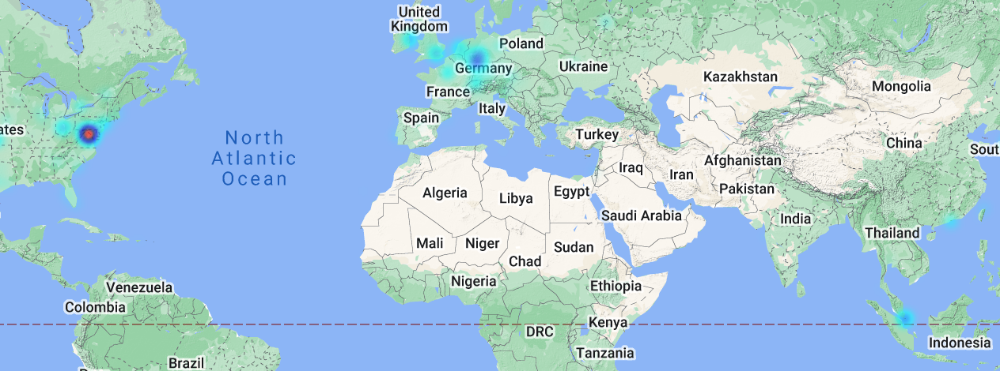
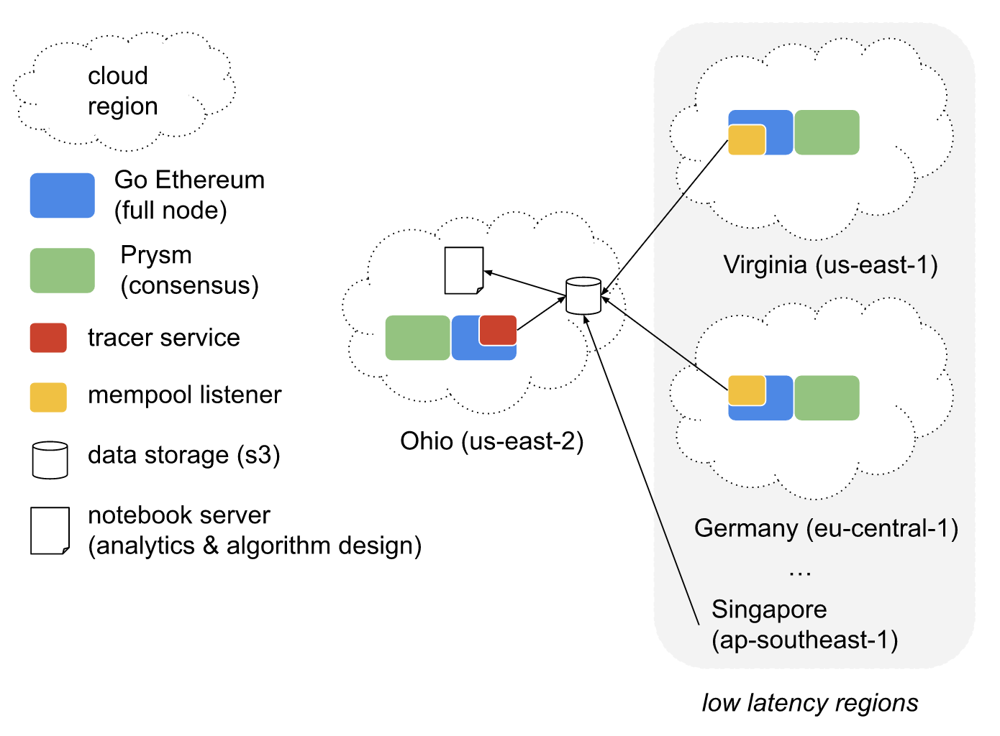

# Data Collection

## Specs

According to stated objectives:

> measure and detect MEV slippage

the following transaction types should be recognized.

1. *transaction reordering* **Attacks**: front running and sandwiches.
2. **Arbitrage**: it is benefiting users by making sure that transactions are executed at market price. In this case, even a negative MEV slippage could be considered fair. Opportunistic block placements should still take arbitrage into account and even more when a transaction creates a pricing differential. *Why wouldn't a transaction profit from the arbitrage of its own trade?* The blockchain is no exclusive business.  
3. **Trades**: in the most common case of market-driven slippage, trades participate in price discovery.

Block sequencing of attacks, arbitrage and trades make up MEV pitfalls and opportunities.

## Services
Two services provide data to help identify transaction types of interest.

- a **Mempool Listener** of incoming pending transactions to record the initial ordering and detect attacks
- a pre/post **Block Tracer** to retrieve ERC20 transfer logs and calculate Extracted Value

## Architecture

*screenshot of [ethernodes.org/countries](https://www.ethernodes.org/countries) on 2022-12-07*


Ethernodes reveals the highest densities of Ethereum nodes in mainnet. Top 3 locations are on the East Coast of the US, in Germany and Singapore. Assuming that the load of incoming transactions would tend to be distributed across nodes, top densities should experience the lowest latencies, which would be ideal to record the order of transactions as close as possible to reality. Despite our best efforts, bots tend to benefit from lower latencies. The assessment of transaction reordering will give a lower bound minimizing false positives.

An *architecture* maximizing chances to gather insights on distributed txs has been derived:


- Our global setup samples networks of mempool data providers, like [bloXroute](https://bloxroute.com/) and [Blocknative](https://www.blocknative.com/), leveraged by MEV traders. 
- The tracer runs on a different Ethereum node not to add any load bias to one of the 3 mempool listeners.

## First Test Run

We first ran the global network for more than 4 days, including a full UTC day (2022-12-13) with active services on synced nodes to generate a batch of data. After sync, all clients but the tracer have been scaled down from 4 to 2 vCPUs. We observed a daily cost of $60 to run the full architecture described above.

Referenced code from commit *3b85c87* in github.com/dapfyi/[dap](https://github.com/dapfyi/dap):
- The cloud init [config](https://github.com/dapfyi/dap/blob/3b85c87d9c1d676799f74560b2c0401bfea359b7/client/client.yaml#L487-L555) added the ability to run Python deamons on Geth nodes.
- The mempool [listener](https://github.com/dapfyi/dap/blob/3b85c87d9c1d676799f74560b2c0401bfea359b7/client/scripts/daemons/mempool_listener.py) triggered a OOM failure of Geth on a 8GiB instance in us-east-1, while running fine in Singapore and Frankfurt.
    - It needs to handle a 10k event buffer, which is IO bound. When running on a single CPU, persisting events too often runs the risk to be disconnected if the buffer is overwhelmed, while growing this buffer increases the memory footprint. The Python script already served its purpose for a one-off analysis. It should be rewritten in Rust to gain efficiency in the next iteration.
- The original [tracer](https://github.com/dapfyi/dap/blob/3b85c87d9c1d676799f74560b2c0401bfea359b7/client/scripts/daemons/prepost_block_tracer.py) failed to handle 1% of blocks, which contained anonymous events with no topic. It has then been fixed in the following [commit](https://github.com/dapfyi/dap/blob/98d422c41fd5189ae75d8d7a5784eb2b9561787d/client/scripts/daemons/prepost_block_tracer.py).

Transactions were filtered on receipt logs so the tracer could easily keep up with the blockchain:
```python
if log_count <= MAX_TRACED_LOGS and erc20_txs > 0 and erc721_txs < 2:
```
We didn't trace transactions...
- w/ more than 10 event logs, as a measure of computation complexity, which proved more representative than gas; 
- w/ no ERC20 transfer, plain Eth transfers are not subject to MEV;
- of NFT aggregations, which added significant delays.

## Appendix A: Regional Deployment

Setting an AWS profile name to its region confirms that you are deploying blockchain nodes where intended at the command line:

`DaP ~ AWS_PROFILE set: runtime to authenticate with [us-east-1] AWS profile.`

Commands to bootstrap nodes in every one of the 4 regions:\
set the `REGION` variable and chose the last parameter `Pyd=true` or `Pyd2=true` according to architecture.
```bash
REGION=us-east-1
# profile can be a different name than region
aws configure --profile $REGION  # enter deploy region when prompted 
export AWS_PROFILE=$REGION  # same name as profile above
# move to github.com/dapfyi/dap/client folder to run commands below
mv '<path to repo>'/dap/client
# checkout the commit with fix for handling of anonymous events
git checkout 98d422c  # avoid breaking changes
# deploy blockchain network
./stack.sh network.yaml

# run commands below only if you already have a Prysm backup
FROM=us-east-2  # set FROM and TO according to main and low-latency target regions
TO=$REGION  # this example moves the Beacon Chain from Ohio to North Virginia
KEY=prysm/mainnet/data/mainnet/beaconchaindata/beaconchain.db
account=`aws sts get-caller-identity --query Account --output text`
# will take some time to transfer > 150 GiB as of Dec 2022
aws s3 cp s3://dap-$FROM-client-$account/$KEY s3://dap-$TO-client-$account/$KEY

# add EnableBackup=true if you could transfer a backup to save days syncing
./stack.sh prysm.yaml
# check which symbolic link (pyd or pyd2) is tied to the daemon you’d like to run
ls -l scripts/daemons/pyd.py  # scripts/daemons/pyd.py -> prepost_block_tracer.py
# we enable Pyd to run the prepost_block_tracer.py on this node (Pyd2 for pyd2.py)
./stack.sh geth.yaml Pyd=true
# OR
ls -l scripts/daemons/pyd2.py  # check that pyd2 points to mempool_listener.py
./stack.sh geth.yaml Pyd2=true  # deploy execution client with mempool listener
```